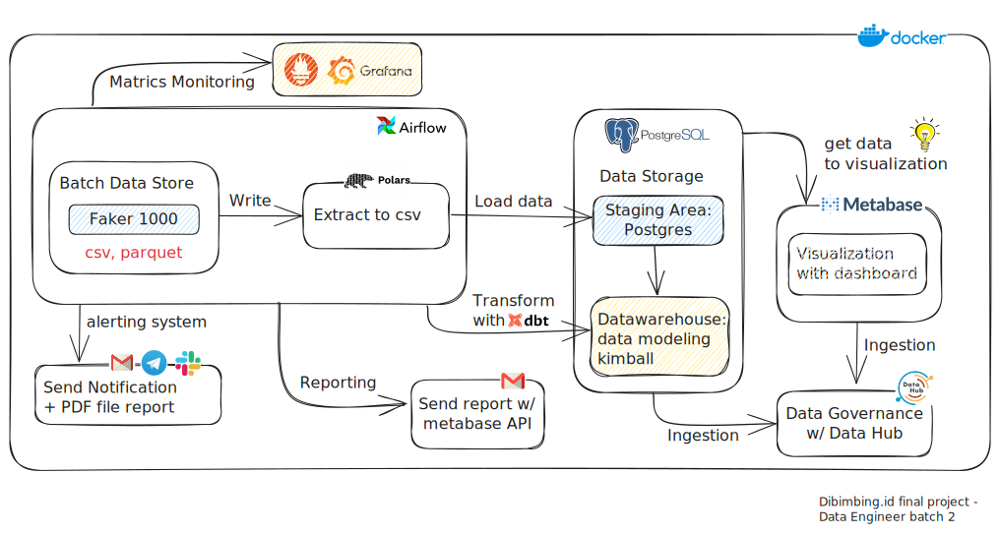

# Dibimbing, Data Engineering Bootcamp
# Final Project

---
```
"## docker-build	- Build Docker Images (amd64) including its inter-container network."
"## postgres		- Run a Postgres container"
"## metabase		- Creating DB metabaseappdb and Run a Metabase container"
"## jupyter		- Spinup jupyter notebook for testing and validation purposes."
"## airflow		- Spinup airflow scheduler and webserver."
```
---



Need edit here with your:
- AIRFLOW__SMTP__SMTP_PASSWORD=<YOUR APP PASSWORD HERE> in docker-compose-airflow.yml and EMAIL_ADDR in .env

Need create connection in airflow for send notifications telegram & slack:
- telegram_default
- slack_default

If you want dbt run in localhost:
- go to \dbt\dibimbing_final_project\Scripts\activate.bat (use CMD) or Active.ps1 (Use Powershell)
- after that run dbt with command dbt run in dibimbing_final_project folder
note:
change value profiles.yml in dibimbing_final_project folder with your connections postgres

I have run this dbt in localhost and airflow successfully.
result on localhost:
