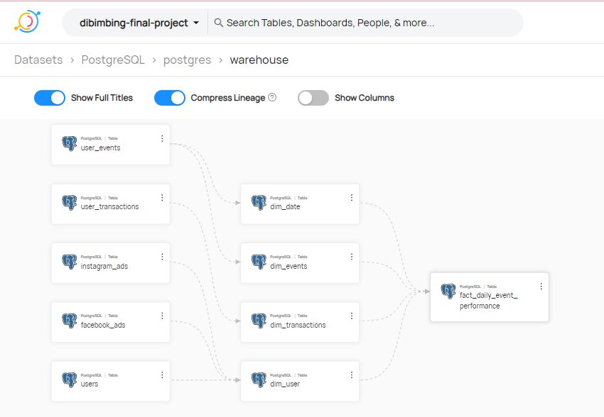

# Final Project, [Dibimbing](https://dibimbing.id/) Data Engineering - Batch 2


## Concept
Raw data from faker will be extracted by polars into csv format, then PostgresOperator with .sql write to postgres. after that airflow send dbt run command to transformation data. airflow will use the metabase api to send reports via email. a metabase get data from postgres to visualization. and Data Hub organizes and stores metadata about your datasets.

## Tech Stack
1. `Docker`: Manages application dependencies in a container and ensures consistent environments.
2. `Apache Airflow`: Orchestrates the data pipeline tasks, making it easier to schedule, monitor, and manage workflows.
3. `DBT (Data Build Tools)`: Used for transforming and modeling data in the data pipeline.
4. `Postgresql`: A powerful, open-source relational database management system used for storing and retrieving data.
5. `Polars`: A DataFrame library implemented in Rust and designed for performance, used for data manipulation and analysis.
6. `Metabase`: Provides a user-friendly interface for reporting and data visualization, making it easy for non-technical users to explore and understand the data.
7. `MetabaseAPI`: interact with Metabase API with the help of Metabase API we can create pulse and send report.
8. `Jupyter`: Used for interactive and exploratory data analysis, providing a convenient environment for testing and prototyping.
9. `PostgresOperator`: An operator in Apache Airflow specifically designed for executing SQL commands and scripts on PostgreSQL.
10. `EmailOperator`: Allows integration with email systems in Apache Airflow, enabling notification and communication within workflows.
11. `TelegramHook`: Facilitates integration with Telegram in Apache Airflow, allowing for notifications and communication via Telegram.
12. `SlackWebhookOperator`: Enables communication and notifications through Slack within Apache Airflow workflows.
13. `PDFkit`: A JavaScript PDF generation library, possibly used for creating PDF reports or documents in the data pipeline.
14. `Faker`: Generate the random values for producer data.
15. `DataHub`: is like a librarian for your data. It organizes and stores metadata about your datasets, making it easier for teams to find, understand, and use data effectively. It's your go-to catalog for efficient data management and collaboration.

## Prerequisites
Before running the data pipeline, ensure you have the following prerequisites installed, configured, and running:
- [Apache Airflow](https://airflow.apache.org/docs/apache-airflow/stable/start/index.html)
- [Docker](https://www.docker.com/)
- [Postgres](https://www.postgresql.org/)
- [Metabase](https://www.metabase.com/)
- [DBT](https://docs.getdbt.com/)

## Get Started
### 1. clone repository
- git clone <repository_url>
- cd <repository_directory>
### 2. run make help
---
```
"## docker-build	- Build Docker Images (amd64) including its inter-container network."
"## postgres		- Run a Postgres container"
"## metabase		- Creating DB metabaseappdb and Run a Metabase container"
"## jupyter		- Spinup jupyter notebook for testing and validation purposes."
"## airflow		- Spinup airflow scheduler and webserver."
"## datahub		- Spinup datahub and any other stack requirement."
```
---

## DBT (T in Transformation)
### 1. if you want try run command dbt run in localhost
- <project_dir>\dbt\env\Scripts\
- run file Activate.ps1 (for PowerShell) or activate.bat (for CMD)
- then go to <project_dir>\dbt\dibimbing_final_project
- command dbt run


## Data Hub
### Ingestion
- you can ingestion data with ingestion menu in data hub, for Create, schedule, and run DataHub ingestion sources.
- after ingestion, you can setup lineage for your dataset


## Customize it to your own
- AIRFLOW__SMTP__SMTP_PASSWORD in docker-compose-airflow.yml
- slack_default, telegram_default, connection_postgres in connection Airflow
- variable pulse_data in metabase_api.py
- and everything you need to change

## Version
`apache-airflow-providers-smtp==1.3.1`
`apache-airflow-providers-telegram==4.1.1`
`apache-airflow-providers-slack==8.0.0`
`polars==0.19.7`
`pdfkit==1.0.0`
`Faker==19.10.0`
`dbt-postgres==1.6.6`
`python-dotenv==0.20.0`
